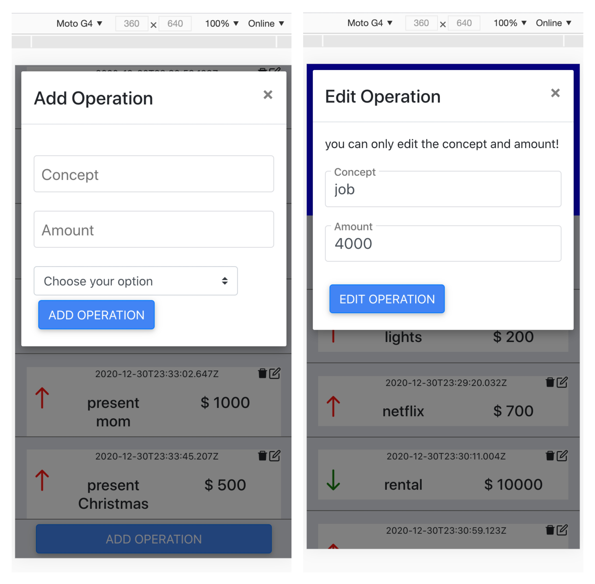

##  About the App

In this challenge I had to create an app to manage the personal budget. creating the backend and using it as api on the frontend.

Backend:  sequelize, postgresSQL and express.

Fontend: ReactJs Hooks and Sass

   

 

   

 

## Install the Project
you should do npm install in "api" and "client" folder.

- in the api folder run npm run dev
- in the client npm start
and will have the project running! :)
